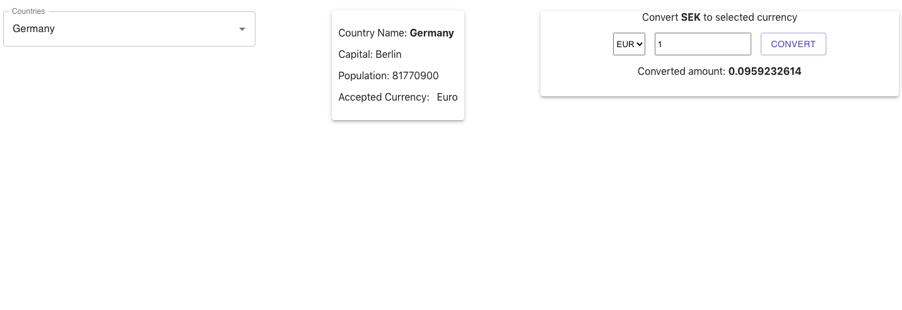
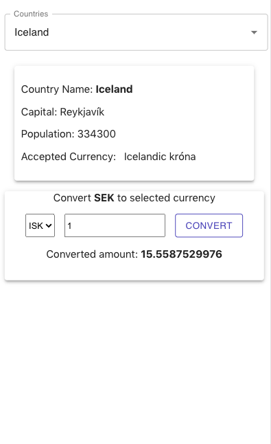

# Currency Converter
This small web application helps the user to pick a country and then gives the country information such as capita, population. It also converts SEK to the selected local currency. 

### For Developers
- `https://github.com/manasarjun/currency-converter.git`
- `cd currency-converter`
- `npm i`
- `npm start`

### Preview

- Desktop view

- Mobile view
